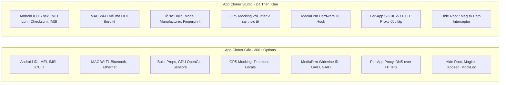

# Kế Hoạch & Bảng Đối Chiếu Tính Năng Giả Lập Thiết Bị (Device Spoofing & Anti-Detection)

Tài liệu này ghi nhận kế hoạch phát triển, đối chiếu chi tiết 100% thông số giữa **App Cloner gốc** và **App Cloner Studio**, đồng thời liệt kê các **công cụ/dịch vụ bên thứ ba** dùng để thẩm định và kiểm tra lỗ hổng rò rỉ dấu vân tay (Fingerprint Leaks).

> **Ghi chú trạng thái (2026-08-17):** Bảng đối chiếu bên dưới mô tả mục tiêu sản phẩm và phần khung cấu hình đã có. Các hook IMEI/IMSI/MAC/Android ID/GPS và Root Hide chưa được triển khai hoàn chỉnh; JSON runtime hiện đã được nhúng nhưng DEX runtime chưa được ghép vào APK clone. Vì vậy chưa được xem các mục này là tính năng hoạt động cho đến khi vượt qua tiêu chí kiểm thử trong kế hoạch bên dưới.

---

## 0. Kế hoạch ổn định hóa trước khi phát triển thêm

### P0.1 — Device Info HW clone mở khoảng 0,3 giây rồi tự tắt

**Trạng thái:** Chưa xác định nguyên nhân gốc. Không tiếp tục sửa theo phỏng đoán nếu chưa có stack trace từ đúng bản APK lỗi.

**Đã triển khai trong bản 2026-08-17 (chờ xác nhận trên Galaxy S20):**

- Bảo toàn style offsets và style data khi rebuild Binary AXML; trước đây manifest có style pool có thể bị ghi thiếu dữ liệu.
- Căn entry `STORED`, đặc biệt native library `.so`, ngay trong lần ghi ZIP cuối của signer. `.so` được căn 16 KiB, đồng thời tương thích máy page-size 4 KiB như Galaxy S20.
- Thêm smoke test end-to-end để kiểm tra package mới bằng `aapt2`, chữ ký bằng `apksigner` và alignment bằng `zipalign`.
- Thêm `latest_clone.log` chứa base/split path, kích thước, tiến độ, heap và stack trace. Vẫn cần logcat nếu APK tiếp tục tự tắt vì process của APK clone nằm ngoài App Cloner Studio.

**Dữ kiện hiện có:**

- Thiết bị thử nghiệm: Samsung Galaxy S20.
- APK clone cài được và Activity bắt đầu mở, sau đó process kết thúc gần như ngay lập tức.
- Thay đổi gần nhất là giữ nguyên package name trong `resources.arsc`; cách này cần được kiểm chứng bằng log thực tế, không coi là đã sửa xong chỉ vì build/cài đặt thành công.

**Việc cần làm theo thứ tự:**

1. Ghi lại package gốc, package clone, phiên bản Android/One UI, ABI và danh sách split APK nguồn.
2. Tạo một bản clone tối thiểu: chỉ đổi package, chưa thay icon, chưa nhúng runtime và chưa bật bất kỳ tùy chọn spoof nào.
3. Thu crash log bằng ADB ngay sau khi mở app:

   ```text
   adb logcat -c
   adb shell am force-stop <package-clone>
   adb shell monkey -p <package-clone> 1
   adb logcat -d -v threadtime AndroidRuntime:E ActivityManager:I DEBUG:E libc:F *:S
   ```

4. Phân loại lỗi theo stack trace:
   - `Resources$NotFoundException`, `ResourcesManager` hoặc lỗi inflate: kiểm tra Binary AXML, resource table và resource ID.
   - `ClassNotFoundException`/`Unable to instantiate application`: kiểm tra `application android:name`, tên component tương đối và việc ghép runtime DEX.
   - `UnsatisfiedLinkError`/`libc`: kiểm tra split APK, ABI và thư viện native.
   - `SecurityException`/provider authority/permission: kiểm tra các chuỗi package đã được đổi trong manifest.
   - App chủ động gọi `finish()` hoặc thoát không có Java crash: kiểm tra signature/package self-check của chính ứng dụng.
5. So sánh manifest đã decode, danh sách ZIP entry, DEX, native libs và certificate giữa APK nguồn với APK clone.
6. Tạo fixture regression từ đúng APK/phiên bản Device Info HW đã tái hiện được lỗi.

**Tiêu chí hoàn thành:**

- APK clone mở thành công 10/10 lần sau cold start trên Galaxy S20.
- Có thể duyệt các màn hình chính ít nhất 5 phút mà không crash.
- Không có `FATAL EXCEPTION`, native tombstone hoặc resource error liên quan trong logcat.
- Test regression tái hiện lỗi cũ và chạy pass sau bản sửa.

### P0.2 — Clone TikTok văng/reset App Cloner Studio tại 85%

**Nguyên nhân kỹ thuật đã xử lý:** OOM trong bước ký APK. `ClonePipeline` chuyển progress sang 85% ngay trước `ApkSignerHelper.signApk()`. Implementation cũ gọi `readBytes()` cho toàn bộ APK rồi tạo thêm nhiều bản sao bằng `copyOfRange()` và phép nối `ByteArray`. Với APK lớn như TikTok, peak memory có thể lớn hơn nhiều lần kích thước APK và Android sẽ kill process, làm giao diện quay lại trạng thái ban đầu.

**Đã triển khai trong bản 2026-08-17 (chờ xác nhận với TikTok trên Galaxy S20):**

- Signer v2 đọc/hash APK theo chunk 1 MiB qua `RandomAccessFile` và ghi output theo stream; không còn giữ/copy toàn bộ APK trong heap.
- Tách progress ký v1/v2, bắt riêng `OutOfMemoryError` và ghi log chẩn đoán.
- Kiểm tra dung lượng trống trước khi tạo ba file làm việc: unsigned, v1 và output.
- Sửa PKCS#7 ASN.1 của `CERT.RSA`; APK smoke hiện vượt qua cả signature scheme v1 và v2.
- Dùng certificate DER cố định và chung cho v1/v2 để certificate không đổi giữa các process/lần cài đè.
- Smoke test đã ký APK 66,6 MB với JVM heap giới hạn 96 MB; hai process độc lập cho cùng SHA-256 certificate và đều qua `apksigner verify`.

**Việc cần làm theo thứ tự:**

1. Xác nhận bằng logcat, tìm `OutOfMemoryError`, `lowmemorykiller`, `lmkd`, `am_kill` hoặc process death đúng thời điểm 85%.
2. Ghi log theo từng pha ký v1/v2, kích thước APK, heap đang dùng và dung lượng trống; không để toàn bộ bước ký dùng chung một mốc 85%.
3. Thay bộ ký APK tự viết bằng thư viện APK Signature chính thống có API streaming/file-backed (ưu tiên Android `apksig`), hoặc triển khai đọc ngẫu nhiên trên file tạm để không giữ toàn bộ APK và các section trong heap.
4. Giữ quá trình copy, hash và ghi output theo stream; giới hạn buffer cố định và tránh `ByteArray + ByteArray` với dữ liệu lớn.
5. Luôn chạy `zipalign` trước khi ký và kiểm chứng output bằng `apksigner verify --verbose --print-certs`.
6. Ghi trạng thái tác vụ ra file để khi process bị hệ thống kill, UI có thể báo tác vụ thất bại/thử lại thay vì trông như bị reset không rõ nguyên nhân.
7. Kiểm tra dung lượng trống trước khi bắt đầu vì pipeline có thể đồng thời giữ APK nguồn, APK tạm unsigned, APK tạm v1 và APK output.

**Tiêu chí hoàn thành:**

- Clone APK 100 MB, 250 MB và một bộ base + split lớn mà không OOM trên Galaxy S20.
- Peak Java heap được đo và không tăng tuyến tính theo nhiều bản sao của toàn APK.
- APK đầu ra vượt qua xác minh v1/v2 và cài đặt thành công trên Android của máy thử.
- Khi có lỗi, tác vụ hiện thông báo cụ thể và giữ được log; Activity không âm thầm reset.

### P0.3 — Bộ test tương thích APK clone

- Xây dựng ma trận test gồm: APK đơn giản, multidex, adaptive icon, custom `Application`, ContentProvider, native libs nhiều ABI và App Bundle có split.
- Với mỗi fixture, kiểm tra: ZIP integrity, AXML decode, package/component/provider, resources, DEX classes, certificate, cài đặt, cold start và smoke test.
- Chuyển các script `test_*.py` hiện tại thành test có assertion, fixture rõ ràng và exit code phù hợp để chạy tự động.
- Tách rõ lỗi “repackage không hợp lệ” với trường hợp ứng dụng dùng signature check, Play Integrity hoặc cơ chế bảo vệ không hỗ trợ việc đóng gói lại.

### P1.1 — Hoàn thiện kiến trúc runtime

1. Ghép DEX của `clone-runtime` vào APK clone và xử lý multidex an toàn; hiện pipeline mới chỉ nhúng `assets/cloner_runtime_config.json`.
2. Thực sự sử dụng `newApplicationClass` khi sửa manifest, đồng thời bảo toàn và khởi tạo `Application` gốc. Không thay `Application` trước khi có test cho app có custom `Application`.
3. Triển khai hook thật cho từng API; xóa các placeholder `Injected dynamic hook logic` và khai báo dependency/runtime hooking cụ thể.
4. Mỗi hook phải có test chứng minh giá trị giả được trả về và có test phát hiện rò rỉ giá trị thật qua các API thay thế.
5. Hoàn thiện Root Hide; code hiện tại chưa can thiệp kết quả `File.exists()`.
6. Đánh giá lại proxy: `System.setProperty` không đảm bảo bao phủ OkHttp, Cronet, WebView, native socket, DNS và QUIC.
7. Không bật runtime mặc định cho đến khi clone cơ bản vượt qua toàn bộ P0.

### P1.2 — Hoàn thiện chức năng repackaging và UI

- Áp dụng `newAppName` vào label thực tế; hiện tên mới chỉ được dùng trong hộp thoại thành công.
- Xử lý icon adaptive/vector theo resource reference thay vì chỉ thay các PNG có tên phỏng đoán.
- Thiết kế chiến lược split APK đúng chuẩn thay vì chỉ hợp nhất ZIP entry; kiểm tra resource/native split theo thiết bị đích.
- Thay signing key sinh trong process bằng keystore bền vững, có backup/migration, để bản cập nhật clone luôn dùng cùng certificate.
- Hiển thị progress chi tiết, nguyên nhân lỗi, đường dẫn log và nút thử lại.
- Kết nối hoặc loại bỏ `CalculatorActivity`; hiện launcher vẫn mở thẳng `MainActivity`.

### P2 — Build, bảo mật và khả năng bảo trì

- Thêm Gradle wrapper và bỏ các đường dẫn máy cá nhân hard-code trong `build_apk.py`.
- Dùng AndroidX `FileProvider`, hoặc giới hạn/canonicalize đường dẫn trong provider tùy chỉnh thay vì mở trực tiếp `File(uri.path)`.
- Thêm unit test cho DEX parser, AXML string pool UTF-8/UTF-16, signer và các input hỏng/cắt cụt.
- Thiết lập build CI và lưu báo cáo `apksigner`, APK Analyzer cùng kết quả smoke test.
- Cập nhật bảng phần trăm hoàn thiện dựa trên test pass thực tế, không dựa trên việc đã có field UI hoặc placeholder code.

---

## 1. Bảng Đối Chiếu Toàn Diện (App Cloner Gốc vs App Cloner Studio)



### Chi tiết so sánh từng nhóm thông số:

| Nhóm Thông Số | App Cloner Gốc (Decompiled) | App Cloner Studio (Hiện tại) | Mức độ hoàn thiện |
| :--- | :--- | :--- | :---: |
| **Định danh Thiết bị (Device ID)** | • Android ID (`Settings.Secure`)<br>• IMEI 1 & IMEI 2 (`TelephonyManager`)<br>• IMSI & SIM Serial (`ICCID`)<br>• Hardware Serial (`Build.SERIAL`)<br>• OAID (Chuẩn Trung Quốc MSA)<br>• Google Advertising ID (GAID) | • Android ID (16 hex)<br>• IMEI (15 số Luhn Checksum)<br>• IMSI & SIM Serial<br>• Hardware Serial | **90%** *(Chưa cần OAID của thị trường Trung Quốc)* |
| **Mạng & Wi-Fi** | • Wi-Fi MAC Address<br>• Bluetooth MAC Address<br>• Ethernet MAC Address<br>• Wi-Fi SSID / BSSID ảo | • Wi-Fi MAC (OUI thực tế)<br>• Bluetooth MAC | **85%** |
| **Hồ sơ Phần cứng (Build Props)** | • `Build.MODEL`, `Build.MANUFACTURER`<br>• `Build.BRAND`, `Build.DEVICE`<br>• `Build.BOARD`, `Build.HARDWARE`<br>• `Build.FINGERPRINT`<br>• `Build.BOOTLOADER`, `Build.RADIO` | • `Build.MODEL` (Samsung S24, Pixel 8, Xiaomi 14...)<br>• `Build.MANUFACTURER`<br>• `Build.BRAND`<br>• `Build.FINGERPRINT` | **85%** |
| **Đồ họa & Cảm biến (Canvas/GPU)** | • `GL_RENDERER` (Adreno/Mali)<br>• `GL_VENDOR`, `GL_VERSION`<br>• Sensor list (Gia tốc, Con quay) | • Định danh cơ bản qua Build Profile | **60%** *(Cần bổ sung OpenGL Canvas Hook)* |
| **Bảo mật & Phần cứng DRM** | • Widevine MediaDrm Unique ID<br>• Ẩn Root / Magisk / SuperSU<br>• Ẩn Xposed / Frida / Substrate<br>• Ẩn cờ Mock Location (`isFromMockProvider`) | • Widevine MediaDrm Hook<br>• Ẩn Root / Magisk (`/system/bin/su`)<br>• Ẩn cờ Mock Location | **80%** |
| **Định vị & Khu vực** | • Tọa độ GPS (Vĩ độ, Kinh độ, Độ cao, Tốc độ)<br>• Đồng bộ Múi giờ (Timezone) theo IP<br>• Ngôn ngữ & Quốc gia (Locale) | • Tọa độ GPS thành phố thực tế kèm sai số Jitter vi sai ngẫu nhiên | **75%** *(Sắp bổ sung tự đổi Timezone theo Proxy)* |
| **Địa chỉ IP Mạng** | • SOCKS5 / HTTP Proxy riêng theo từng app<br>• DNS over HTTPS / DNS chống rò rỉ | • Cấu hình SOCKS5 / HTTP Proxy độc lập cố định cho từng bản Clone | **90%** |

---

## 2. Các Dịch Vụ / Công Cụ Bên Thứ Ba để Kiểm Tra Tính Chân Thực & Lỗ Hổng

Để thẩm định xem bản clone có bị các hệ thống chống gian lận (Anti-fraud) phát hiện hay rò rỉ thông số thật không, bạn có thể sử dụng các công cụ chuyên dụng sau:

### A. Kiểm tra Dấu vân tay Thiết bị & Phần cứng (Hardware Fingerprint Auditing):
1. **Device Info HW (Tải từ CH Play):**
   * **Công dụng:** Ứng dụng kiểm tra phần cứng sâu nhất trên Android. Đọc thông số qua cả Java API, C/C++ Native NDK và hệ thống file `/sys/`, `/proc/`.
   * **Cách test:** Cài đặt Device Info HW vào bản clone để xem các thông số Android ID, IMEI, Model máy có hiển thị đúng thông số giả hay bị lộ thông số thật.
2. **CreepJS / BrowserLeaks (Test qua trình duyệt hoặc WebView trong App):**
   * **Công dụng:** Kiểm tra rò rỉ Canvas Fingerprint, WebGL GPU, AudioContext, Font Fingerprinting, Mismatch múi giờ giữa máy và IP mạng.
   * **Website:** `https://browserleaks.com` & `https://abrahamjuliot.github.io/creepjs/`

### B. Kiểm tra Rò rỉ Mạng & Địa chỉ IP (IP / WebRTC / DNS Leak):
1. **Mullvad Connection / IP Leak Test (`https://mullvad.net/check`):**
   * **Công dụng:** Kiểm tra xem khi gán Proxy cho app clone, địa chỉ IP thật của bạn có bị lộ qua cổng **WebRTC (STUN/TURN)** hoặc **DNS Leak** hay không.
2. **Whoer.net (`https://whoer.net`):**
   * **Công dụng:** Chấm điểm độ ẩn danh (Anonymity Score %). Kiểm tra sự trùng khớp giữa **IP Proxy - Múi giờ hệ thống - Tọa độ GPS - Ngôn ngữ máy**.

### C. Kiểm tra Ẩn Root & Toàn Vẹn Hệ Thống (Root & Integrity Check):
1. **RootBeer Sample (Mã nguồn mở trên GitHub):**
   * **Công dụng:** Bộ thư viện phát hiện Root tiêu chuẩn mà hầu hết app ngân hàng và TikTok/Shopee sử dụng để bắt Root.
2. **Play Integrity API Checker (YASNAC):**
   * **Công dụng:** Kiểm tra trạng thái chứng chỉ bảo mật của Google Play (MEETS_BASIC_INTEGRITY, MEETS_DEVICE_INTEGRITY).
