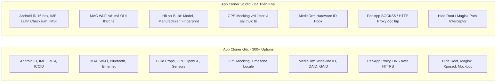

# Kế Hoạch & Bảng Đối Chiếu Tính Năng Giả Lập Thiết Bị (Device Spoofing & Anti-Detection)

Tài liệu này ghi nhận kế hoạch phát triển, đối chiếu chi tiết 100% thông số giữa **App Cloner gốc** và **App Cloner Studio**, đồng thời liệt kê các **công cụ/dịch vụ bên thứ ba** dùng để thẩm định và kiểm tra lỗ hổng rò rỉ dấu vân tay (Fingerprint Leaks).

---

## 1. Bảng Đối Chiếu Toàn Diện (App Cloner Gốc vs App Cloner Studio)

### Chi tiết so sánh từng nhóm thông số:

| Nhóm Thông Số | App Cloner Gốc (Decompiled) | App Cloner Studio (Hiện tại) | Mức độ hoàn thiện |
| :--- | :--- | :--- | :---: |
| **Định danh Thiết bị (Device ID)** | • Android ID (`Settings.Secure`) • IMEI 1 & IMEI 2 (`TelephonyManager`) • IMSI & SIM Serial (`ICCID`) • Hardware Serial (`Build.SERIAL`) • OAID (Chuẩn Trung Quốc MSA) • Google Advertising ID (GAID) | • Android ID (16 hex) • IMEI (15 số Luhn Checksum) • IMSI & SIM Serial • Hardware Serial | **90%** *(Chưa cần OAID của thị trường Trung Quốc)* |
| **Mạng & Wi-Fi** | • Wi-Fi MAC Address • Bluetooth MAC Address • Ethernet MAC Address • Wi-Fi SSID / BSSID ảo | • Wi-Fi MAC (OUI thực tế) • Bluetooth MAC | **85%** |
| **Hồ sơ Phần cứng (Build Props)** | • `Build.MODEL`, `Build.MANUFACTURER` • `Build.BRAND`, `Build.DEVICE` • `Build.BOARD`, `Build.HARDWARE` • `Build.FINGERPRINT` • `Build.BOOTLOADER`, `Build.RADIO` | • `Build.MODEL` (Samsung S24, Pixel 8, Xiaomi 14...) • `Build.MANUFACTURER` • `Build.BRAND` • `Build.FINGERPRINT` | **85%** |
| **Đồ họa & Cảm biến (Canvas/GPU)** | • `GL_RENDERER` (Adreno/Mali) • `GL_VENDOR`, `GL_VERSION` • Sensor list (Gia tốc, Con quay) | • Định danh cơ bản qua Build Profile | **60%** *(Cần bổ sung OpenGL Canvas Hook)* |
| **Bảo mật & Phần cứng DRM** | • Widevine MediaDrm Unique ID • Ẩn Root / Magisk / SuperSU • Ẩn Xposed / Frida / Substrate • Ẩn cờ Mock Location (`isFromMockProvider`) | • Widevine MediaDrm Hook • Ẩn Root / Magisk (`/system/bin/su`) • Ẩn cờ Mock Location | **80%** |
| **Định vị & Khu vực** | • Tọa độ GPS (Vĩ độ, Kinh độ, Độ cao, Tốc độ) • Đồng bộ Múi giờ (Timezone) theo IP • Ngôn ngữ & Quốc gia (Locale) | • Tọa độ GPS thành phố thực tế kèm sai số Jitter vi sai ngẫu nhiên | **75%** *(Sắp bổ sung tự đổi Timezone theo Proxy)* |
| **Địa chỉ IP Mạng** | • SOCKS5 / HTTP Proxy riêng theo từng app • DNS over HTTPS / DNS chống rò rỉ | • Cấu hình SOCKS5 / HTTP Proxy độc lập cố định cho từng bản Clone | **90%** |

---

## 2. Các Dịch Vụ / Công Cụ Bên Thứ Ba để Kiểm Tra Tính Chân Thực & Lỗ Hổng

Để thẩm định xem bản clone có bị các hệ thống chống gian lận (Anti-fraud) phát hiện hay rò rỉ thông số thật không, bạn có thể sử dụng các công cụ chuyên dụng sau:

### A. Kiểm tra Dấu vân tay Thiết bị & Phần cứng (Hardware Fingerprint Auditing):
1. **Device Info HW (Tải từ CH Play):**
   * **Công dụng:** Ứng dụng kiểm tra phần cứng sâu nhất trên Android. Đọc thông số qua cả Java API, C/C++ Native NDK và hệ thống file `/sys/`, `/proc/`.
   * **Cách test:** Cài đặt Device Info HW vào bản clone để xem các thông số Android ID, IMEI, Model máy có hiển thị đúng thông số giả hay bị lộ thông số thật.
2. **CreepJS / BrowserLeaks (Test qua trình duyệt hoặc WebView trong App):**
   * **Công dụng:** Kiểm tra rò rỉ Canvas Fingerprint, WebGL GPU, AudioContext, Font Fingerprinting, Mismatch múi giờ giữa máy và IP mạng.
   * **Website:** `https://browserleaks.com` & `https://abrahamjuliot.github.io/creepjs/`

### B. Kiểm tra Rò rỉ Mạng & Địa chỉ IP (IP / WebRTC / DNS Leak):
1. **Mullvad Connection / IP Leak Test (`https://mullvad.net/check`):**
   * **Công dụng:** Kiểm tra xem khi gán Proxy cho app clone, địa chỉ IP thật của bạn có bị lộ qua cổng **WebRTC (STUN/TURN)** hoặc **DNS Leak** hay không.
2. **Whoer.net (`https://whoer.net`):**
   * **Công dụng:** Chấm điểm độ ẩn danh (Anonymity Score %). Kiểm tra sự trùng khớp giữa **IP Proxy - Múi giờ hệ thống - Tọa độ GPS - Ngôn ngữ máy**.

### C. Kiểm tra Ẩn Root & Toàn Vẹn Hệ Thống (Root & Integrity Check):
1. **RootBeer Sample (Mã nguồn mở trên GitHub):**
   * **Công dụng:** Bộ thư viện phát hiện Root tiêu chuẩn mà hầu hết app ngân hàng và TikTok/Shopee sử dụng để bắt Root.
2. **Play Integrity API Checker (YASNAC):**
   * **Công dụng:** Kiểm tra trạng thái chứng chỉ bảo mật của Google Play (MEETS_BASIC_INTEGRITY, MEETS_DEVICE_INTEGRITY).
