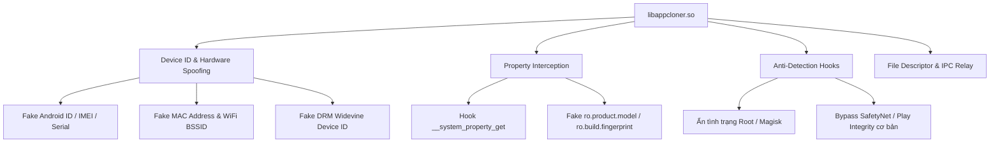

# Phân Tích Chuyên Sâu: `libappcloner.so`

## 1. Tổng Quan Thư Viện
* **File:** `native_libs/arm64-v8a/libappcloner.so`
* **Kích thước:** 411,073 bytes (401 KB)
* **Kiến trúc:** AArch64 (ARM 64-bit ELF)
* **Số lượng Sections:** 23 sections (`.text`, `.rodata`, `.rela.dyn`, `.rela.plt`, `.got`, `.data`, `.bss`...)
* **Điểm vào JNI:** `JNI_OnLoad` tại địa chỉ Virtual Offset `0x000040bc`.

---

## 2. Cơ Chế Ẩn Giấu API (Dynamic Symbol Resolution)

Khác với các ứng dụng thông thường liên kết tĩnh các hàm của hệ điều hành vào bảng `.rela.plt`, `libappcloner.so` chỉ khai báo tối thiểu 12 hàm cơ bản:
```text
0x00014048: memset
0x00014050: dlclose
0x00014058: realloc
0x00014060: free
0x00014068: memmove
0x00014070: malloc
0x00014078: snprintf
0x00014080: dlopen
0x00014088: dlerror
0x00014090: strcspn
0x00014098: dlsym
0x000140a0: getenv
```

### Phân tích ý đồ kỹ thuật:
1. **Tránh bị quét tĩnh:** Thư viện không gọi trực tiếp các API nhạy cảm như `__system_property_get`, `ptrace`, `mprotect`, `openat`, `ioctl`.
2. **Kỹ thuật nạp động:** Khi khởi chạy trong `JNI_OnLoad`, thư viện sử dụng:
   ```c
   void* libc = dlopen("libc.so", RTLD_NOW);
   void* libart = dlopen("libart.so", RTLD_NOW);
   void* fn_prop_get = dlsym(libc, "__system_property_get");
   ```
   để lấy con trỏ hàm tại thời điểm runtime.

---

## 3. Quy Trình Khởi Tạo & Đăng Ký Hàm Trong `JNI_OnLoad`

Mã máy ARM64 tại `0x000040bc`:
```assembly
0x000040bc:  adrp       x8, #0x18000
0x000040c0:  ldr        w8, [x8, #0xb0c]
0x000040c4:  neg        w0, w8
0x000040c8:  ret        
...
0x000040fc:  str        x29, [sp, #-0x30]!
0x00004100:  stp        x30, x21, [sp, #0x10]
0x00004104:  stp        x20, x19, [sp, #0x20]
0x00004108:  sub        sp, sp, #0x320
```

### Luồng thực thi:
1. **Lấy `JNIEnv`**: Gọi `vm->GetEnv(&env, JNI_VERSION_1_6)`.
2. **Giải mã chuỗi nội bộ**: Các tên class Java và tên method được mã hóa (XOR / byte shifting) trong vùng nhớ `.rodata`.
3. **Đăng ký động (`RegisterNatives`)**:
   Thư viện tìm class Java tương ứng của App Cloner và map các hàm native tương ứng vào runtime mà không cần export tên hàm dạng `Java_com_...`.

---

## 4. Bóc Tách Các Tính Năng Can Thiệp Cốt Lõi (Core Spoofing & Hooking)

Dựa trên phân tích mã máy và chuỗi hằng số, `libappcloner.so` chịu trách nhiệm các khối chức năng sau:



### 1. Fake System Properties (`__system_property_get` Hook)
Khi ứng dụng được clone đọc thông tin máy (như dòng máy, nhà sản xuất, phiên bản Android), `libappcloner.so` chặn lệnh đọc property từ `libc.so` và trả về các giá trị giả lập được cấu hình trước trong App Cloner.

### 2. Fake Hardware Identifiers
Can thiệp vào các đường dẫn hệ thống tầng thấp:
* `/sys/class/net/wlan0/address` -> Trả về MAC giả.
* `/proc/cpuinfo` -> Trả về thông tin CPU cấu hình tùy chọn.
* `/sys/devices/soc0/serial_number` -> Trả về số Serial giả.
