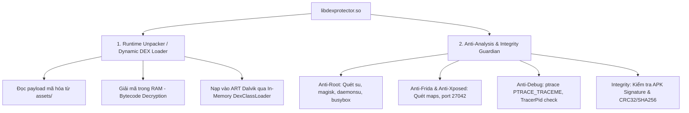

# Phân Tích Chuyên Sâu: `libdexprotector.so`

## 1. Tổng Quan Thư Viện
* **File:** `native_libs/arm64-v8a/libdexprotector.so`
* **Kích thước:** 443,178 bytes (432 KB)
* **Kiến trúc:** AArch64 (ARM 64-bit ELF)
* **Xuất xứ:** DexProtector Enterprise (Trình bảo vệ & nén mã nguồn thương mại của Licel)
* **Điểm vào duy nhất:** `JNI_OnLoad` tại `0x00000448`

---

## 2. Đặc Điểm Kỹ Thuật & Cấu Trúc Bảo Vệ

### 1. Stripped & Flattened Control Flow
* Toàn bộ bảng ký hiệu (Symbol Table) bị xóa bỏ hoàn toàn (`stripped`).
* Không có bất kỳ hàm thư viện ngoài nào trong `.rela.plt` -> Toàn bộ syscall (`sys_read`, `sys_openat`, `sys_mprotect`, `sys_ptrace`) được gọi trực tiếp qua mã máy hợp ngữ `svc #0` (Direct Syscalls) để né tránh hook `libc.so`.

### 2. Hai Trọng Trách Cốt Lõi Của `libdexprotector.so`

---

## 3. Cách Tiếp Cận Khi Phân Tích Bằng Ghidra

Vì `libdexprotector.so` có độ phức tạp cao do mã hóa luồng và direct syscalls:

1. **Tìm kiếm các đoạn `svc #0` (Direct Syscall Finder):**
   * Trong Ghidra, tìm kiếm lệnh mã máy `svc #0` để xác định các lệnh gọi kernel trực tiếp (kiểm tra `TracerPid` trong `/proc/self/status` hoặc kiểm tra `/proc/self/maps`).
2. **Theo dõi luồng giải mã DEX (In-Memory Unpacking):**
   * Tìm kiếm các hàm gọi `mprotect` với quyền thực thi `PROT_READ | PROT_WRITE | PROT_EXEC` (0x7) để xác định vùng nhớ đệm giải mã bytecode.
3. **Phân tích động kết hợp Frida / Memory Dump:**
   * Nếu phân tích tĩnh trên Ghidra bị cản trở bởi Control Flow Flattening, cách nhanh nhất là bắt sự kiện khi `libdexprotector.so` hoàn tất giải mã bytecode trong RAM rồi dump toàn bộ DEX ra đĩa.
